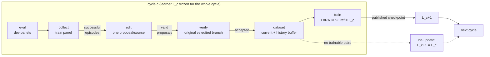
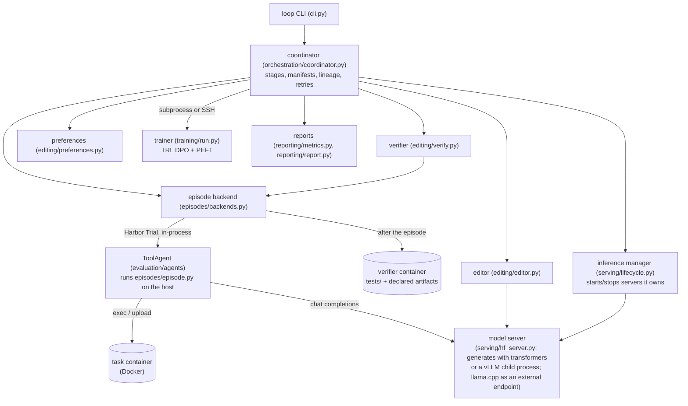
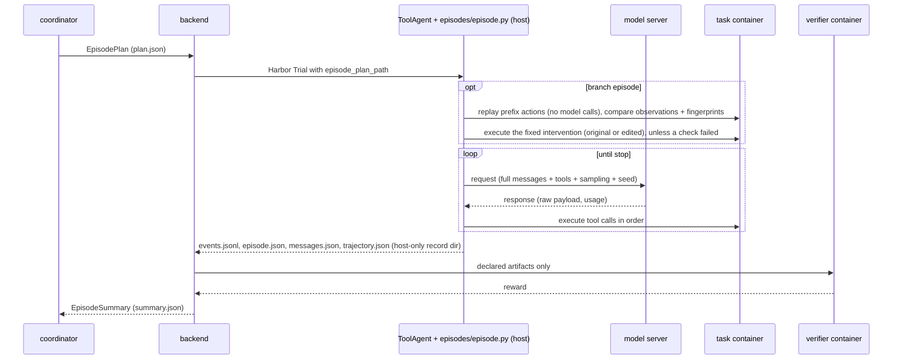

# Architecture

The components, where they run, the data between them, and what each may see. Method:
[experiment.md](experiment.md). Run files: [run-layout.md](run-layout.md). Tasks, grading and
replay: [../evaluation/README.md](../evaluation/README.md). Terms: [glossary.md](glossary.md).

## The loop in one picture

`L_c` is the learner checkpoint used throughout cycle `c`.



Each box is a **stage**. A stage writes under `runs/<run>/cycles/cycle-NNN/<stage>/` and records
its **work items** in a manifest under stable IDs, so it can be resumed or run alone
(`loop stage`). The final cycle only runs `eval`; the control conditions skip stages (see
[experiment.md](experiment.md#conditions-and-controls)).

## Components and where they run

[Harbor](https://github.com/laude-institute/harbor) is the external framework that builds a
task's Docker container, runs an agent against it as a *trial*, and grades the result in a
separate verifier container.



Three machine roles, which one or two hosts can share:

| Role | Runs | Machine profile keys |
|---|---|---|
| Coordinator / environment runner | `loop`, Harbor, the ToolAgent, task and verifier containers | `coordinator`, `environment_backend`, `docker_concurrency` |
| Inference endpoint | a server per checkpoint started by the run (`managed`: `hf_server`, plus its vLLM child process with `backend: vllm`), an existing endpoint such as llama.cpp (`external`), or a scripted fixture | `inference`, optional `editor_inference` |
| Training host | `python -m learning_loop.training.run`, locally or over SSH | `training` |

`loop dashboard` is a separate read-only process next to the run directory. It never takes the
run lock, so it can watch a run while `loop run` holds it. `loop submit` starts a run on the
machine profile's SSH coordinator (for example a Linux host with Docker), and `loop fetch`
copies the run directory back.

### Remote hosts

- `kind: ssh`: a fixed host reached through an alias in `~/.ssh/config`.
- `kind: runpod`: an existing pod (`pod_id`) or one created per command from a spec (`pod:`, an
  entry in `runpod.create`).

For pods, `hosts/pods.py` wraps each command. It creates the pod or starts the existing one,
finds its current SSH address, prepares it (`scripts/setup_gpu_host.sh`, code, `uv sync`),
starts the idle watchdog, and at the end terminates a created pod or stops an existing one. The
inference manager opens the SSH tunnel to a pod's model server, because a pod's address changes
when it restarts. Results live only in the coordinator's run directory, so losing a pod loses
only work in progress, which is redone. Details: [runpod.md](runpod.md).

### Serving on one accelerator

Without `editor_inference`, the learner and the editor share one serving slot. Each inference
manager runs one server at a time and stops only servers it started, so a cycle goes:

1. learner (eval, collect);
2. editor, if it is a different checkpoint (edit);
3. learner again (verify, audit);
4. no server while the dataset is built and the trainer runs;
5. the new checkpoint (next cycle).

## Repository layout

```text
AGENTS.md, CLAUDE.md          developer guide (CLAUDE.md includes AGENTS.md)
README.md                     setup and operation
docs/                         this documentation (contents: docs/index.md)
experiments/                  experiment YAML (scientific choices); ablations/ overrides pilot.yaml
configs/models/               model identity, serving and training profiles (pinned revisions)
configs/machines/             deployment profiles: examples/ (committed), local/ (git-ignored)
prompts/editor/v1.md          editor prompt (its hash is part of the editor identity)
scripts/                      GPU host setup (setup_gpu_host.sh), pod idle watchdog (pod_watchdog.py)
.env.example                  template for the git-ignored .env
evaluation/                   everything Harbor-facing (see evaluation/README.md)
  agents/                       ToolAgent, tools, system prompt
  tasks/                        hand-written tasks
  generators/                   instance generators per family
  splits/                       split files: instances and panels
  scripts/                      task data helpers
  configs/, run.sh              plain `harbor run` workflow
src/learning_loop/            the loop (module map below)
tests/                        unit/, integration/ (-m docker), train/ (-m train), fixtures/
runs/                         run directories (git-ignored)
artifacts/                    local state outside runs, e.g. the created-pod ledger (git-ignored)
.engines/                     a generation engine's own environment, e.g. vLLM, made on the serving host (git-ignored)
pyproject.toml, uv.lock       package, `loop` entry point, pinned dependencies (`train` extra)
```

## Module map (`src/learning_loop/`)

| Package | Module | What lives here |
|---|---|---|
| (top level) | `cli.py` | `loop` commands |
| `core/` | `records.py` | typed, versioned records |
| | `interfaces.py` | session, backend, policy, editor, verifier and trainer interfaces |
| | `config.py` | experiment / machine / model schemas, `base:` inheritance, `--set` overrides |
| | `seeds.py` | seed streams and stable IDs |
| | `storage.py` | atomic writes, append-only JSONL, run lock, stage manifests |
| | `provenance.py` | code, package and hardware identity |
| | `envfile.py` | `.env` loading |
| `tasks/` | `instances.py` | split files to content-hashed task instances; split validation |
| | `spec.py` | task families as Python specs: `Family`, `TaskSpec`, `Solution` (shell + Python model), grader kinds, container profiles |
| | `generate.py` | (family, difficulty, seed) to a checked spec: the oracle model passes, shortcut models and doing nothing fail |
| | `render.py` | the only writer of a task directory: pinned image without `RUN`, profile `ENV`, no network, fixed mtimes, hidden key |
| | `runtime/` | `grade.py` (shared grader) and `probe.py` (environment probe): shipped into task containers, also run on the host |
| | `family_lint.py` | rejects family modules that use randomness or time other than `GenContext.rng` |
| `episodes/` | `envs/` | environment sessions: Harbor container, local fixture |
| | `fingerprint.py` | state fingerprint (runs in the container) |
| | `backends.py` | run and grade one episode: `HarborDockerBackend`, `LocalFixtureBackend` |
| | `policy.py` | OpenAI-compatible and scripted policies |
| | `episode.py` | the agent loop, budgets, stop reasons, replay + intervention |
| | `events.py` | `events.jsonl` writer and per-turn view (`load_turns`) |
| `editing/` | `editor.py` | editor input, answer tools (`replace_with_<tool>`, `abstain`), LLM and scripted editors, proposal validation |
| | `verify.py` | branch replay, branch costs, the acceptance rule, audits |
| | `preferences.py` | preference pairs, exports, history buffer |
| | `token_count.py` | learner-tokenizer length of a fixed turn |
| `training/` | | rendering (`render.py`), model and adapter loading and log-probs (`modeling.py`), TRL DPO (`dpo.py`), fixture trainer (`fixture.py`), publication (`common.py`), trainer CLI (`run.py`) |
| `serving/` | `hf_server.py`, `tool_parse.py` | the model server: renders prompts with `training/render.py`, parses tool calls, counts usage with the training tokenizer; generates with transformers + PEFT or a vLLM engine |
| | `vllm_engine.py` | vLLM as a child process of `hf_server` that only generates, from token ids, in its own environment (`.engines/`) |
| | `equivalence.py` | GPU check that the vLLM engine matches transformers + PEFT (log-probs and greedy output, base and adapters) |
| | `managed.py` | HTTP and port helpers; `ManagedHFServer`, a local `hf_server` that the `-m train` tests start and stop |
| | `lifecycle.py` | which checkpoint is served where; starts and stops the run's own servers, locally or over SSH (with the SSH tunnel to a pod); policy specs |
| `orchestration/` | `coordinator.py` | runs, cycles, stages, retries, lineage, resume |
| | `smoke.py` | smoke levels |
| | `external_eval.py` | pinned external Harbor benchmark configs |
| `hosts/` | `remote.py`, `remote_jobs.py` | SSH/rsync; submit/fetch/status; `sync-hosts` |
| | `pods.py` | Runpod pod lifecycle |
| | `preflight.py` | environment checks |
| `reporting/` | `metrics.py`, `report.py` | aggregation, comparisons, CSV + markdown reports |
| | `dashboard.py` | `loop dashboard` |
| `docs_tools/` | `docgen.py`, `docserver.py` | generated doc sections; `loop docs` viewer |

Imports point downward: `core` imports nothing else; `tasks` and `training` import only `core`;
`episodes` adds `tasks`; `editing` adds `episodes` (plus `training/render.py` for token counts and
`serving/tool_parse.py` for the editor's answer); `serving` adds `training` and `hosts/remote.py`;
`orchestration` wires everything, and `hosts/remote_jobs.py` sits above it. This keeps the
ToolAgent, which Harbor loads, and the trainer, which runs as its own process, free of the
coordinator.

Torch, PEFT and TRL (the `train` extra) are imported only inside functions of `training/`,
`serving/` and `hosts/preflight.py`, so the coordinator runs without them.

## Data flow

### Configuration to run

```text
experiments/X.yaml (+ base:, --set) ─┐
configs/machines/.../M.yaml ─────────┼─> validate (schemas, compatibility, panels, splits)
configs/models/<profile>.yaml ───────┘        │
evaluation/splits/<split>.yaml ──> instances.materialize ──> runs/<id>/tasks/<instance>/
                                              │
                                              └─> runs/<id>/run.json (write-once, resolved, secret-free)
                                                  runs/<id>/provenance.json, seed_schedule.json
```

### One episode (eval, collect or branch)

A *branch* episode is one side of a verification: it replays a source episode's earlier tool
calls in a fresh container, executes the original or the edited action at the edited turn, and
then lets the learner continue.



`events.jsonl` is the complete episode record, and every later stage reads episodes from it
(`events.load_turns`). It holds each request as sent, the raw response, requested and executed
tool arguments, and fingerprints, which replay needs. `messages.json` and `trajectory.json` are
views for people and Harbor's viewer and lack these.

### Across stages

What each stage reads. Its outputs go to `cycles/cycle-NNN/<stage>/` (see
[run-layout.md](run-layout.md)).

| Stage | Reads |
|---|---|
| eval, collect | task instance, served checkpoint, seeds |
| edit | `events.jsonl` of fully successful collect episodes |
| verify | the source `events.jsonl` + one proposal |
| audit (optional) | accepted proposals; never changes datasets |
| dataset | accepted verifications + source events; earlier cycles' `dataset/current/` |
| train | `dataset/preferences.jsonl` and the incoming checkpoint |
| reports | manifests, summaries, proposals, verifications, dataset manifests, `cycle.json` |

Only the `prompt`, `chosen`, `rejected` and `tools` fields of `preferences.jsonl` are rendered
into model inputs. The trainer reads the companion `provenance.jsonl` only to count pairs by kind
and verification mode.

## Who sees what

| Actor | Can see | Cannot see | Enforced by |
|---|---|---|---|
| Learner | system prompt, instruction, tool schemas, its own conversation and tool output | tests, solution, verifier output, other episodes | each request carries only this episode's messages; tests and solution never enter the task container |
| Task container | the task's `environment/` files and what the learner writes | `tests/`, `solution/`, episode records | records go to a host directory that is not mounted into it |
| Verifier container | `tests/` + declared artifacts from the task container | the task container | built fresh from `tests/`; receives only the files listed as `artifacts` |
| Editor | instruction, system prompt, tool schemas, the learner's turns and tool output, optionally its outcome (success, partial reward, token, request and tool-call counts) | tests, solutions, verifier output, other trajectories, held-out instances | its only input is the view from `build_trajectory_view` (`editing/editor.py`), built from one episode collected on the training panel |
| Trainer | preference rows, the incoming checkpoint | verification evidence, editor justifications | both live in `provenance.jsonl`, which is never rendered; building a pair fails if its prompt contains either (`editing/preferences.py`) |
| Learning loop | its own run directory | evaluation runs, final-test panels, external benchmarks | its eval stage runs only `evaluation.dev_panels`; `loop evaluate --final` and `loop external-eval` write to other run directories |
| Dashboard | the served run directories, including transcripts and grader output; the `--log` file and the created-pod ledger | any other file; it never writes | URL paths and symlinks that lead outside a served run are refused |

How the containers are separated is in
[evaluation/README.md](../evaluation/README.md#hidden-grading).

## Identities and lineage

| Object | Identity |
|---|---|
| Task instance | `family/difficulty/sSEED` or `family/static` (from the split file), plus hashes of the task directory and of its learner-visible inputs; the second lets split validation reject the same content in two splits |
| Base checkpoint | `base:<profile>@<rev12>` (first 12 characters of the pinned revision) |
| Trained checkpoint | `cNNN-<hash12>` over run, cycle, dataset hash, incoming checkpoint, training config, seed, trainer |
| Editor | hash of mode, checkpoint, prompt SHA-256, decoding settings |
| Episode (`ep-`) | hash of run, stage, cycle, checkpoint, instance, attempt (and panel, for eval) |
| Proposal (`prop-`) | hash of run, cycle, source episode and editor (the editor makes one proposal per source) |
| Verification (`ver-`) | hash of proposal and purpose (`acceptance` or `audit`) |

The hashes are SHA-256 over the listed parts (`core/seeds.py`), so re-running a stage computes
the same IDs and finds its completed items. `checkpoint.json` records parent and DPO reference;
the coordinator refuses a trained checkpoint whose parent or reference is not the incoming
learner. Seeds are hashes of a named stream plus explicit parts (`core/seeds.py`), so purposes
that share parts, such as the acceptance and audit repetitions of one proposal, still get
independent seeds. Evaluation seeds depend only on `seeds.root`, instance and attempt, so every
checkpoint is evaluated on the same seeds.

## Extension points

| To add | Implement | Notes |
|---|---|---|
| A task family | `evaluation/generators/<family>.py`, added to `GENERATORS` in `evaluation/generators/__init__.py` and referenced in a split file | follow `evaluation/README.md` |
| An environment type | an `EnvironmentSession` and an `EpisodeBackend` (`core/interfaces.py`) | set the session's `capabilities.restore` to `deterministic_replay` only if a fresh session plus the replayed prefix reproduces the state; branch episodes stop before the intervention on any other value |
| A trainer | the `Trainer` interface (`core/interfaces.py`), a `training.trainer` value and its dispatch in `training/run.py` | continue the incoming adapter, use it as the DPO reference and publish through `training/common.py` (the coordinator checks parent and reference); add `-m train` tests |
| A serving backend | a `serving` entry in the model profile + its launch command in `serving/lifecycle.py`, or a generation engine behind `hf_server` | declare `adapter_formats`; learning runs require `peft_lora`, the format the trainer writes. An engine behind `hf_server` keeps rendering, parsing and token counting unchanged, so it only needs an equivalence check like `serving/equivalence.py` that its generations match |
| An editor condition | a new `editor.mode` + its checkpoint choice in `editor_checkpoint` and, for the checks before a run exists, `editor_checkpoint_id` (`orchestration/coordinator.py`) | the mode is part of the editor identity, so its proposals get their own IDs |
| An acceptance rule | a named rule in `editing/verify.py` + a `verification.acceptance_rule` value | every verification records its rule name, so keep `strict_all_success_v1` unchanged and add a new name |
