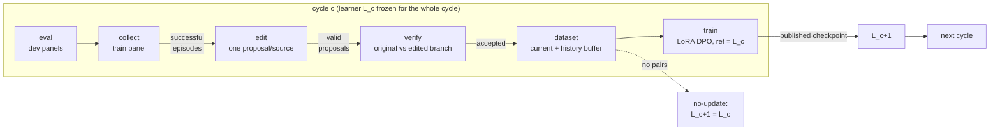
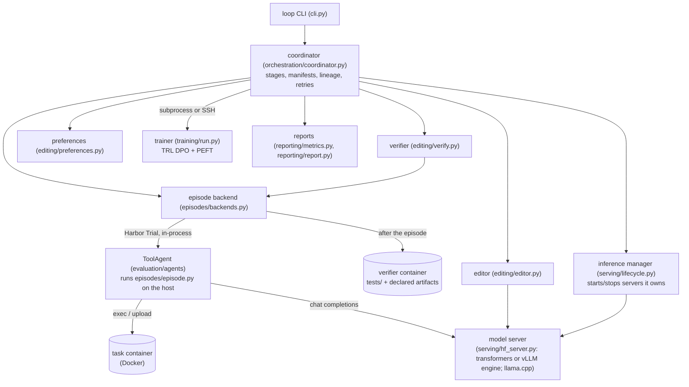
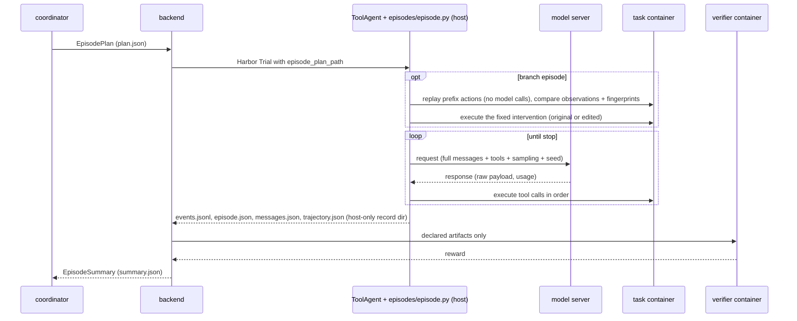

# Architecture

How the repository is put together: the components, where they run, what data moves between
them, and what each actor is allowed to see. The method itself (why the loop is built this way,
acceptance rules, metrics) is in [experiment.md](experiment.md); the layout of a run directory is
in [run-layout.md](run-layout.md); tasks and the replay contract are in
[../evaluation/README.md](../evaluation/README.md).

## The loop in one picture



Each box is a **stage**. Stages write their outputs under `runs/<run>/cycles/cycle-NNN/<stage>/`
and are tracked by a stage manifest of stable work-item IDs, so any stage can be resumed or run
on its own (`loop stage`). The final cycle only evaluates. Conditions change which stages run:
`frozen_baseline` runs only `eval` at cycle 0; `fixed_dataset` skips collect/edit/verify and
trains every cycle on one frozen export.

## Components and where they run



Three machine roles, which may collapse onto one or two hosts:

| Role | Runs | Declared in |
|---|---|---|
| Coordinator / environment runner | `loop`, the coordinator, Harbor, the ToolAgent, Docker task and verifier containers | machine profile `coordinator`, `environment_backend`, `docker_concurrency` |
| Inference endpoint | a model server per checkpoint (`managed`), an existing endpoint (`external`), or a scripted fixture | machine profile `inference` (and optional `editor_inference`) |
| Training host | `python -m learning_loop.training.run` (local subprocess or over SSH) | machine profile `training` |

`loop dashboard` is a separate, read-only process on whichever machine holds the run directory:
it reads run files (never the run lock) and serves them as HTML on a local port, so it can run
next to the coordinator. The laptop can also submit a whole run to a Linux coordinator (`loop submit`), which then runs
Docker locally; `loop fetch` copies the run directory back. A remote host is either a fixed SSH
alias from the user's `~/.ssh/config` (`kind: ssh`) or a Runpod pod (`kind: runpod`): an
existing pod (`pod_id`) or one created per command from a spec (`pod:`, `runpod.create`).
For pods, the pod lifecycle (`hosts/pods.py`) wraps each command: it creates the pod (recording it in a
local ledger and enforcing the spec's price limit) or starts the existing one through the Runpod
REST API, looks up its current address, prepares it (setup script, code, locked environment),
opens the SSH tunnel to its model server, keeps a heartbeat for the pod-side idle watchdog, and
terminates (created) or stops (existing) the pod when the command ends. The coordinator's run
directory stays the only place results live: the pod holds caches, the environment and
in-progress work, which are rebuilt or restarted if the pod is lost.

On a single accelerator the lifecycle is sequential: serve the learner (eval, collect) -> serve
the fixed editor if it differs -> serve the learner again (verify) -> stop serving -> train ->
serve the new checkpoint. The inference manager only ever stops processes it started.

## Repository layout

```text
AGENTS.md, CLAUDE.md          developer guide (CLAUDE.md just includes AGENTS.md)
README.md                     setup and operation
docs/
  index.md                    documentation index (home page of `loop docs`)
  architecture.md             this file
  cli.md                      `loop` reference (generated part from cli.py)
  configuration.md            YAML reference (generated part from core/config.py) + cross-field rules
  experiment.md               method, protocol, acceptance, metrics
  glossary.md                 terms
  operations.md               experiment protocol, smoke path, troubleshooting
  runpod.md                   Runpod / SSH GPU host deployment
  run-layout.md               what a run directory contains
experiments/                  experiment YAML (scientific choices)
  fixture-two-cycles.yaml       scripted learner/editor + fixture trainer (engineering check)
  smoke-mac.yaml                bounded live loop for the laptop (Qwen3)
  pilot.yaml                    small real pilot on the target model (needs a CUDA host)
  frozen-baseline.yaml          control: initial checkpoint only
  fixed-dataset-control.yaml    control: same optimizer steps on one frozen export
  ablations/                    one-level overrides of pilot.yaml (editor, verification, audit,
                                easy-only, family exposure)
configs/
  models/                     model identity + serving + training profiles (pinned revisions)
  machines/examples/          committed deployment examples
  machines/local/             private deployment profiles (git-ignored)
prompts/editor/v1.md          versioned editor prompt (its hash is part of the editor identity)
scripts/setup_gpu_host.sh     prepares a Linux GPU host (e.g. a Runpod pod) over SSH
scripts/pod_watchdog.py       pod-side idle watchdog (stops the pod when the heartbeat goes stale)
.env.example                  template for the git-ignored .env (credentials by variable name)
evaluation/                   everything Harbor-facing (see evaluation/README.md)
  agents/                       ToolAgent, tools, system prompt
  tasks/                        hand-written tasks (log-triage, fix-stats)
  generators/                   versioned instance generators per family
  splits/                       hand-authored panels (pilot, smoke, fixture)
  configs/, run.sh              plain `harbor run` workflow (no learning loop)
src/learning_loop/            the loop (module map below)
  cli.py                        `loop` entry point
  core/                         contracts: records, interfaces, config schemas, seeds, storage
  tasks/                        task instances and split files
  episodes/                     episode loop, policies, environments, backends
  editing/                      editor, verification, preferences, token counts
  training/                     trainers, rendering, checkpoint publication
  serving/                      model server, tool-call parsing, serving lifecycle
  orchestration/                coordinator, smoke levels, external evaluations
  hosts/                        SSH hosts, remote jobs, Runpod pods, preflight
  reporting/                    metrics, reports, dashboard
  docs_tools/                   docs generation and the docs viewer
tests/
  unit/                       default suite: no Docker, no model downloads
  integration/                `-m docker`: real Harbor containers
  train/                      `-m train`: real LoRA DPO on Qwen3-0.6B
  fixtures/                   scripted policies/editors, fixture preferences, test builders
runs/                         run directories (git-ignored), see run-layout.md
artifacts/                    large local caches (git-ignored)
pyproject.toml, uv.lock       package, `loop` entry point, pinned dependencies (`train` extra)
```

## Module map (`src/learning_loop/`)

| Package | Module | Responsibility |
|---|---|---|
| (top level) | `cli.py` | `loop` commands (the `loop` entry point) |
| `core/` | `records.py` | typed, versioned records (episodes, events, proposals, verifications, preferences, checkpoints) |
| | `interfaces.py` | environment session, episode plan/backend, policy, editor, verifier, trainer interfaces |
| | `config.py` | strict experiment / machine / model schemas, `base:` inheritance, `--set` overrides |
| | `seeds.py` | seed streams and stable IDs (SHA-256 over explicit parts) |
| | `storage.py` | atomic writes, append-only JSONL, run lock, stage manifests |
| | `provenance.py` | code/package/hardware identity |
| | `envfile.py` | loads the repository's `.env` into the environment for every `loop` command |
| `tasks/` | `instances.py` | split files -> materialized, content-hashed task instances; split validation |
| `episodes/` | `envs/` | environment sessions: Harbor container (`harbor_session.py`), local fixture (`local_session.py`) |
| | `fingerprint.py` | declared-state fingerprint (runs inside the container) |
| | `backends.py` | run one planned episode + separate grading: `HarborDockerBackend`, `LocalFixtureBackend` |
| | `policy.py` | OpenAI-compatible policy and scripted fixture policy; usage, repairs, error classes |
| | `episode.py` | the agent loop: requests, tool execution, budgets, stop reasons, replay + intervention |
| | `events.py` | `events.jsonl` writer and the derived per-turn view (`load_turns`) |
| `editing/` | `editor.py` | editor view, LLM/scripted editors, proposal validation (eligibility, grounding, budgets) |
| | `verify.py` | branch replay specs, branch costs, `strict_all_success_v1`, audits |
| | `preferences.py` | preference pairs + provenance, immutable exports, history buffer selection |
| | `token_count.py` | learner-tokenizer length of a fixed assistant turn |
| `training/` | | rendering/masking (`render.py`), TRL DPO (`dpo.py`), fixture trainer, publication, CLI (`run.py`) |
| `serving/` | `hf_server.py`, `tool_parse.py` | the model server: renders prompts with `training/render.py`, parses tool calls, counts usage with the training tokenizer; generation by transformers + PEFT (`hf_transformers`) or by a vLLM child process (`vllm`) |
| | `vllm_engine.py` | vLLM as a token engine behind `hf_server`: separate environment (`.engines/`), token ids in and out, pinned sampling, zero/trained LoRA modules |
| | `equivalence.py` | GPU gate: vLLM log-probs and greedy decoding against transformers + PEFT for the base model, a trained adapter and a random adapter |
| | `managed.py` | start/stop an `hf_server` process owned by the caller |
| | `lifecycle.py` | which checkpoint is served where; start/stop owned servers; policy specs |
| `orchestration/` | `coordinator.py` | runs, cycles, stages, retries, lineage, evaluation/edit-replay runs, resume |
| | `smoke.py` | bounded smoke levels |
| | `external_eval.py` | pinned external Harbor benchmarks (job config + protocol note) |
| `hosts/` | `remote.py`, `remote_jobs.py` | SSH/rsync helpers; submit/fetch/status of remote runs; `sync-hosts` |
| | `pods.py` | Runpod pod lifecycle: REST client, current addresses, start/prepare/watchdog/stop |
| | `preflight.py` | environment checks |
| `reporting/` | `metrics.py`, `report.py` | aggregation, paired and multi-seed comparisons, CSV + markdown reports |
| | `dashboard.py` | `loop dashboard`: live, read-only HTML view of run directories (run index, run page, transcripts) using the same row and summary definitions |
| `docs_tools/` | `docgen.py` | generates the reference parts of `docs/cli.md` and `docs/configuration.md` |
| | `docserver.py` | `loop docs`: local HTTP viewer rendering the repository's Markdown |

Dependencies point downward: `core` imports nothing from the rest; `tasks` and `training` import
only `core`; `episodes` imports `core` and `tasks`; `editing` imports `episodes`; the coordinator
(`orchestration`) wires everything. The runner imports without torch; only `training/dpo.py`,
`training/modeling.py` and `serving/hf_server.py` need the `train` extra, and they are used from
separate processes.

## Data flow

### Configuration -> run

```text
experiments/X.yaml (+ base:, --set) ─┐
configs/machines/.../M.yaml ─────────┼─> validate (schemas, compatibility, panels, splits)
configs/models/<profile>.yaml ───────┘        │
evaluation/splits/<split>.yaml ──> instances.materialize ──> runs/<id>/tasks/<instance>/
                                              │
                                              └─> runs/<id>/run.json (write-once, resolved, secret-free)
                                                  runs/<id>/provenance.json, seed_schedule.json
```

### One episode (eval, collect or branch)



`events.jsonl` is the lossless record (every request as sent, raw response, parse errors,
repairs, requested vs executed tool arguments, raw and truncated tool output, fingerprints,
replay checks). Everything downstream reads episodes through it (`events.load_turns`);
`messages.json` is a convenience view only.

### Across stages

| Stage | Reads | Writes (under `cycles/cycle-NNN/`) |
|---|---|---|
| eval | plan inputs: task instance, served checkpoint, eval seed schedule | `eval/items/<ep>/` episode outputs |
| collect | same, collection seeds | `collect/items/<ep>/` |
| edit | successful collect episodes' `events.jsonl` (instruction/tools/system prompt from the `episode_start` plan) | `edit/items/<prop>/proposal.json` |
| verify | the source `events.jsonl` + one proposal | `verify/items/<ver>/{original,edited}-rNN/` branch episodes + `verification.json` |
| audit (optional) | accepted proposals | `audit/items/...` (never changes datasets) |
| dataset | accepted verifications + source events; earlier cycles' `dataset/current/` | `dataset/current/` (this cycle's pairs) and `dataset/` (selected training set), each `preferences.jsonl` + `provenance.jsonl` + `manifest.json` |
| train | `dataset/preferences.jsonl` only, incoming checkpoint | `train/` work files; `runs/<id>/checkpoints/<cNNN-hash>/` |
| cycle state | all of the above | `cycle.json` (learner in/out, reference, update kind, dataset, checkpoint record) |
| reports | manifests, `summary.json`, proposals, verifications, dataset manifests, `cycle.json` | `runs/<id>/reports/` |

The trainer consumes exactly `{prompt, chosen, rejected, tools}` rows; provenance (costs, editor
justification, source episode, split) stays in the companion file and is never rendered into a
model input.

## Who sees what

| Actor | Can see | Cannot see |
|---|---|---|
| Learner (during an episode) | system prompt, task instruction, tool schemas, its own conversation and tool observations | tests, reference solution, verifier output, other episodes |
| Task container | the task's `environment/` files and what the learner writes | `tests/`, `solution/`, host files (records are written host-side) |
| Verifier container | `tests/` + the declared artifacts copied from the agent container | the agent container itself |
| Editor | instruction, system prompt, tool schemas, the learner's turns with observations (including later ones), optional scalar outcome | tests, solutions, verifier output, other trajectories, held-out instances |
| Trainer | preference rows of the exported dataset, the incoming checkpoint | provenance/evidence records |
| Learning loop | its own run directory | evaluation runs, final panels, external benchmarks (separate runs it never reads) |
| Dashboard (for the human operator) | the run directories it serves, including transcripts and grader output | anything outside those runs (URL paths and symlinks are confined); it never writes |

## Identities and lineage

- **Task instance**: `family/difficulty/sSEED` (or `family/static`), with a content hash of the
  task directory and of its learner-visible inputs.
- **Checkpoint**: `base:<profile>@<rev12>` for a base model, `cNNN-<hash12>` for trained adapters
  (hash over run, cycle, dataset hash, incoming checkpoint, training config, seed, trainer).
  `checkpoint.json` records the parent and the DPO reference; the coordinator refuses a checkpoint
  whose reference or parent is not the incoming learner.
- **Editor**: hash of mode, checkpoint, prompt SHA-256 and decoding settings.
- **Work items**: `ep-`, `prop-`, `ver-` IDs derived from the run, stage, cycle, checkpoint and
  instance/attempt (or proposal), so re-running a stage finds the same items.
- **Seeds**: separate streams (`learner_attempt`, `editor_proposal`, `branch_continuation`,
  `training`, `data_selection`, `audit`); evaluation seeds depend only on `seeds.root`, instance
  and attempt, so checkpoints and runs are compared on the same schedule.

## Extension points

| To add | Implement | Notes |
|---|---|---|
| A task family | `evaluation/generators/<family>.py`, register it, reference it in a split file | follow the task and replay contract in `evaluation/README.md` |
| An environment type | an `EnvironmentSession` (execute, fingerprint) and an `EpisodeBackend` | declare an honest `RestoreCapability`; never claim deterministic replay you cannot check |
| A trainer | the `Trainer` interface (TrainRequest -> CheckpointRecord), selectable via `training.trainer` | keep reference/continuation/publication semantics; add `-m train` tests |
| A serving backend | an entry in the model profile's `serving` + argv in `serving/lifecycle.py` (an `hf_server` engine keeps rendering, parsing and token counts identical) | declare `adapter_formats`; validation refuses LoRA runs on backends that cannot load the adapter; a new engine needs an equivalence check like `serving/equivalence.py` |
| An editor condition | `editor.mode` + `make_editor` | the editor identity must change with it |
| An acceptance rule | a new named rule in `editing/verify.py` + config literal | never silently replace `strict_all_success_v1` |
